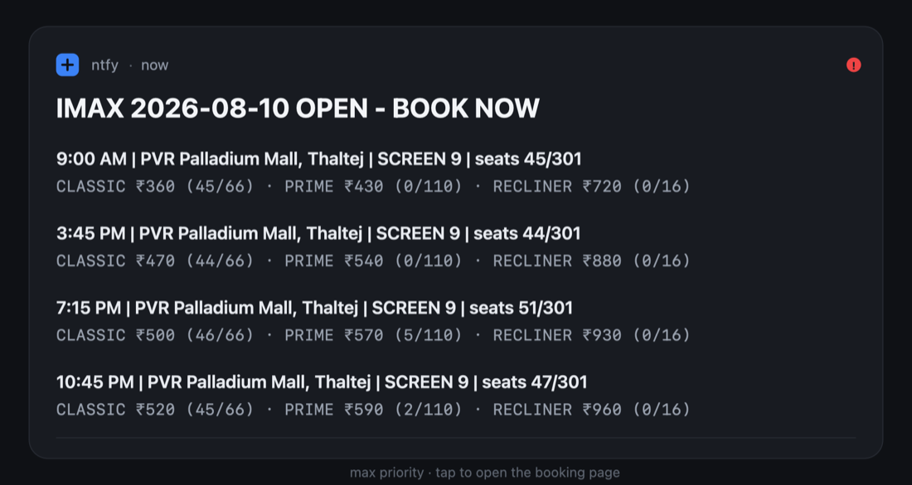

# ticket-monitoring

Watches [district.in](https://www.district.in) showtimes and sends a max-priority push to your
phone the second tickets go on sale for the movie, date, format and cinema you care about.



I built this because IMAX shows kept selling out before I even knew they'd opened. Refreshing the
page a few times a day wasn't working. Now something else checks every 60 seconds and yells at me
when it matters.

## How it works

Every 60 seconds it calls the same showtimes endpoint the District site uses itself. A date that
isn't on sale yet answers with `204 No Content`. The moment it opens, you get the full session
list back. The monitor filters that list down to your cinema and format, then pushes to
[ntfy](https://ntfy.sh), a free open-source notification service with iOS and Android apps.

The part I care most about: silence always means "not open yet". If checks start failing you get a
*Monitor BROKEN* push after six failures in a row, plus an optional daily heartbeat. A monitor
that died at 3am and one that's quietly working should never look the same from the outside.

Alerts are deduplicated by session id in a small state file, so you hear about each show once.
Shows added later still get through.

| Notification | Priority | What it means |
|---|---|---|
| `<FORMAT> <DATE> OPEN - BOOK NOW` | max | The one you're waiting for. Tap it to book. |
| `<DATE> bookings are OPEN (no <FORMAT> yet)` | high | Date opened, your format hasn't shown up yet. |
| `Monitor BROKEN - check manually` | high | Checks are failing. Don't trust the silence. |
| `Monitor recovered` | default | Back to normal. |
| `Still watching <DATE>` | min | Daily heartbeat. |
| `Monitor retired` | default | Target date passed, so it stopped on its own. |

## Requirements

The [ntfy app](https://ntfy.sh/#subscribe-phone) on your phone, and either Docker or Node.js 22+.

## Quick start with Docker

```bash
git clone https://github.com/aculix/ticket-monitoring.git
cd ticket-monitoring
cp .env.example .env      # edit it, see "Finding your IDs" below
docker compose up -d --build
docker compose logs -f
```

You want to see `tick: closed  failures: 0` scrolling past once a minute.

## Quick start without Docker

```bash
npm install
cp .env.example .env      # edit it
npm run check             # one check, tells you what it found
npm start                 # run it for real
```

Run `npm run check` first. It's the fastest way to find out you got an ID wrong, and much less
annoying than discovering it three hours into a run. Needs Node 22+ for the built-in `--env-file`
support.

## Finding your IDs

Everything movie-specific is sitting in one URL. Open the film's District page for your city:

```
https://www.district.in/movies/the-odyssey-movie-tickets-in-ahmedabad-MV187151?frmtid=y7EZNLXN5Y&fromdate=2026-08-10
                                                          └── CITY_KEY ──┘ └CONTENT_ID┘        └─MOVIE_CODE─┘
```

- `CONTENT_ID` is the number after `MV`
- `MOVIE_CODE` is the `frmtid` parameter, which pins down the movie *and* the language
- `CITY_KEY` is the city slug in the path
- `LAT` and `LNG` can be any coordinates inside that city. The API refuses to answer without them,
  though results are city-wide either way.
- `BOOKING_URL` is the whole URL with `fromdate` set to your target date

`CINEMA_ID` is the fiddly one, since it isn't in the URL. Easiest approach: leave it empty at
first, which watches every cinema in the city, then run `npm run check` against a date that's
already bookable and read the ids out of the response. Or just leave it empty for good and let the
alert tell you where the shows are.

Want any format, not only IMAX? Set both `FORMAT_TAG` and `FORMAT_MATCH` to empty.

## Configuration

Everything is environment variables. `.env` is only a convenient place to put them.

| Variable | Default | Purpose |
|---|---|---|
| `MOVIE_CODE` | *required* | `frmtid`, identifies movie and language |
| `CONTENT_ID` | *required* | Movie id, the digits after `MV` |
| `CITY_KEY` | *required* | City slug, e.g. `ahmedabad` |
| `LAT`, `LNG` | *required* | Coordinates somewhere in that city |
| `TARGET_DATE` | *required* | The date you're waiting for, `YYYY-MM-DD` |
| `NTFY_TOPIC` | *required* | The topic you subscribe to. Treat it like a password. |
| `CINEMA_ID` | *(any)* | Restrict to one cinema |
| `FORMAT_TAG` | `imax_2d` | Session tag that counts as a match |
| `FORMAT_MATCH` | `IMAX` | Screen-format substring that counts as a match |
| `FORMAT_LABEL` | `IMAX` | What the format is called in the alert text |
| `BOOKING_URL` | | Opens when you tap the notification |
| `NTFY_URL` | `https://ntfy.sh` | Your own ntfy server, if you run one |
| `NTFY_TOKEN` | | Only if your server wants auth |
| `CHECK_INTERVAL_SECONDS` | `60` | Poll interval |
| `FAILURE_THRESHOLD` | `6` | Failures in a row before the BROKEN alert |
| `TZ_OFFSET_MINUTES` | `330` | Timezone for showtimes, 330 is IST |
| `HEARTBEAT_HOUR` | `9` | Local hour for the daily heartbeat, `-1` turns it off |
| `CURRENCY` | `₹` | Price prefix |
| `EXPIRY_UTC` | *auto* | When to retire. Defaults to local midnight after `TARGET_DATE`. |
| `STATE_PATH` | `./state.json` | Where dedupe state lives, `/data/state.json` in Docker |
| `PORT` | `8080` | Status endpoint |
| `PROXY_URL` | | SOCKS5 proxy for the site checks, see below |

## Status endpoint

While running continuously it serves JSON on `PORT`:

- `/` gives you state, `lastTick` and `proxied`
- `/?force=1` adds a live check right now, with no notifications and no state changes
- `/healthz` returns `{"ok":true}`

Watch `lastTick.at`. If it's more than a couple of minutes old, the loop is stuck.

## Troubleshooting

### Every check returns HTTP 403

The site's WAF is blocking your host. This happens reliably on cloud providers. An earlier version
of this ran as a Cloudflare Worker, worked fine for two days, then got blocked permanently, while
a home connection was never touched once. Either run it from a residential connection, or point
`PROXY_URL` at a SOCKS5 proxy. Only the site checks go through the proxy. Notifications stay
direct, so your alerts don't depend on it.

### ntfy returns HTTP 429

Public ntfy.sh rate-limits by IP, and shared cloud egress IPs are usually spent already by other
people. Self-host ntfy and set `NTFY_URL`, or run from home.

### Notifications arrive, but silently

That's your phone, not the monitor. Open the subscription in the ntfy app and let max-priority
messages through Do Not Disturb.

### Alerts repeat, or never arrive again

Dedupe lives in the state file at `STATE_PATH`, or in the `data/` volume under Docker. Delete it to
start fresh. Do this whenever you change `TARGET_DATE`, otherwise it still thinks it has already
told you about those shows.

### Nothing happens at all

Run `npm run check` for a single noisy check. Configuration problems are reported explicitly.

## Development

```bash
npm test        # 16 tests, no network needed
```

The tests run the alert state machine and session parsing against a real captured API response in
`test/fixtures/`. `src/monitor.js` has the pure logic and the API client, `src/index.js` is the
runner plus state file and status server, `src/config.js` reads the environment.

If you're forking this for another site, [docs/design-notes.md](docs/design-notes.md) covers what I
learned about the API and why the alert logic is shaped the way it is.

## Notes

This polls a public endpoint once a minute, which is roughly what a person refreshing the page
would do, to buy their own tickets. It doesn't automate purchases, hold seats or skip any queue.
Please keep it that way: don't drop the interval, don't run ten copies, don't use it to scalp.

Not affiliated with District, PVR or IMAX. The API is undocumented and can change whenever they
feel like it.

## License

MIT, see [LICENSE](LICENSE).
